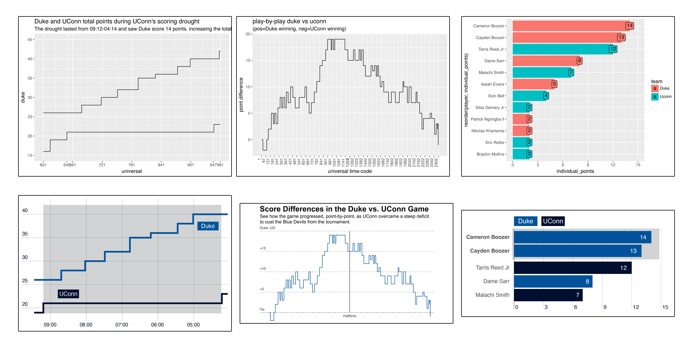

# UConn's Elite Comeback
Created by **[Holden Green](https://hgorledeenn.github.io)** in April 2026 <br>
Columbia Journalism School, Data Studio
<br>
<br>

*This project represents a number of firsts for me – it's my first scrolytelling piece, my first time doing motion graphics/animation in Adobe After Effects and my first time embedding a YouTube video to a website. Below, see how I completed each step and how everything came together for the finished product.*

## Contents:
1. [The Project](#the-project)
2. [Data Collection and Wrangling](#data-collection-and-wrangling)
3. [Visualization](#visualization)
4. [Animation](#animation)
5. [Web Design](#web-design)
7. [What I Would Change for Next Time](#what-i-would-change-for-next-time)

<br>

## The Project
This project presents a point-by-point breakdown of the Duke vs UConn Elite Eight mens basketball game. I ([like many bracket competitors](https://www.ncaa.com/news/basketball-men/article/2026-03-19/duke-again-nations-top-pick-win-2026-ncaa-tournament)) had predicted that Duke would be the champions of the entire tournament. When UConn came back at the end of the match, overcoming a deficit that had been as high as 19 points, my bracket ended up busted.

Perhaps out of some level of frustration – or simply due to the fact that I'd rather dive into the world of sports statistics than watch the Huskies trapse their way to victory – I wanted to understand what went wrong for Duke and why I would have to concede victory in my bracket pool.

><h3 align="left">
>My <i>actual</i> 2026 March Madness bracket
></h3>
><p align="left">
>
></p>

<br>

## Data Collection and Wrangling

### Where it came from

I collected the data from the the ESPN [play-by-play game report](https://www.espn.com/mens-college-basketball/playbyplay/_/gameId/401856577) and manually entered it into a Google Sheet.

I first created index columns where each row represents one second of game time:
- `half`: Indicates what half of the game the given game point takes place in (either 1 or 2)
- `minutes`: How many whole minutes were left in the half at that point in the game
- `seconds`: How many seconds were left in that minute at that point in the game
- `universal`: An ordered list of integers starting at **1** for 20:00 in the first half (the first second of the game) and ending at **2402** for 00:00 in the second half (the last second of the game)

Then, for each second in the game, I recorded:
- `uconn`: UConn's cumulative score at that second of the game
- `duke`: Duke's cumulative score at that second of the game
- `diff`: The difference between Duke and UConn's cumilative scores (+ means Duke winning, - means UConn winning)
- `individual_points`: How many points were scored in that second
- `player`: Which player scored the points scored in that second
- `team`: What team scored the points in that second

<br>

<p align="center">

</p>

### Wrangling in Python

I exported the data I'd collected as a [duke_uconn_game.csv](/data/duke_uconn_game.csv) and imported it into Python. My wrangling was pretty light – because I collected the data manually it was already mostly well-suited for the visualizations I had in mind.

I created a few other dataframes from that data, including making two dataframes, one per team, analyzing scoring droughts (how long each team went between points).

``` python
df_uconn_only['scoring_droughts'] = df_uconn_only['universal'].shift(-1) - df_uconn_only['universal'

df_duke_only['scoring_droughts'] = df_duke_only['universal'].shift(-1) - df_duke_only['universal']
```

| Measures *(seconds)* | Duke | UConn |
| --- | --- | ---|
| Longest Drought | 253 | 299 |
| Mean Drought Length | 67.68 | 70 |
| Median Drought Length | 48 | 47.5 |

<br>
I also made a dataframe that calculates the top scorers at halftime, a data point I was interested in visualizing for the final product.

``` python
df_first_half_points = df[(df['half']==1) & (df['player'].notna())]
df_first_half_top_scorers = df_first_half_points.groupby('player', as_index=False).agg({
    'team': 'first',
    'individual_points': 'sum'
    })
```

### Exploratory Data Analysis

I did lots of EDA during this project. Beyond just finding interesting stats (like the fact that, in the 1st half, the Boozer twins alone [scored 27 points](chart_pngs/top_scorers_ind_first_half.png) for Duke while the entire UConn team only had 29 points), I looked at the progress of the game overall and tried to identify which moments were indicitave of one team's performance or a momentum shift in the game.

I ultimately settled on 8 game moments – 4 from each half – as important to highlight for someoene to fully understand the course of the game.

<br>

## Visualization

I made the 3 visualizations using in Plotnine in my notebook. That code can be found in [data_wrangling.ipynb](/data_wrangling.ipynb). I then exported the visualizations as [.svg files](/plotnine_output/) and brought them into Adobe Illustrator for cleaning and further design.

A few important changes I made were:
- Making chart designs minimal so as to the viewers' attention the most important visual elements
- Keeping colors and fonts consistent across charts to increase visual cohesion in the finished product
- Adding range highlights to subtly direct attention without distracting from the chart content
<br>

><h3 align="left">
>The Plotnine <i>(rough)</i> and Illustrator <i>(finished)</i> exports of the three charts I made
></h3>
><p align="left">
>
></p>

<br>

## Animation

This project represented many firsts for me. Most notably, though, this was my first time using Adobe After Effects. I used AE in order to animate my main line chart so that the data would appear as the viewer scrolls through the page. This allowed me to break down what might be a confusing chart (of point *differences* over time during the game) and direct the viewers' attention to the important parts of the game I was highlighting.

The process of animating mostly involved assigned keyframes to different elements across the timeline. But, before I animated, I did a lot planning (and a *lot* of math) to determine where each keyframe should be for each of the elements.

I also made a detailed content management spreadsheet to track where each scrollytelling break should be (so that the boxes line up with the breaks in the animation) and what content I would include at each point. This pre-planning ended up being incredibly helpful as I completed the actual animation, and I referred to my detailed CMS sheet continuously during the process.

><h3 align="left">
>My CMS spreadsheet for this project
></h3>
><p align="left">
>
></p>

I also learned how to make auto-updating number displays in After Effects, which I used to make the scoreboard animation on the upper-left corner of the point differences chart.

<br>

## Web Design

This project was hosted online with the use of a template provided by my professor, though I made quite a few changes in order to best display my content.

The template helped with some of the basics of a scrollytelling website, but I made modifications to the timing of the scrollytelling elements and the design of the text highlights to work better (both in design and in matching the speed of the animation).

This project was also my first time embedding a YouTube video, which I did to make the ending of the game, in which UConn scored a last-second 3-point shot to win, even more palpable to the viewer.

<br>

## What I Would Change For Next Time

Although I am proud of the project and all the skills I drew upon to complete it, there are definitely things I would do differently for similar projects in the future.

Most notably, the scrollytelling animation technically works on both desktop and mobile, but it is not a truly responsive design. While it functions and will dispaly at least somewhat well on both platforms, for future project, when I had more time or technical support, I would work to make sure the content was displayed clearly on any device, regardless of size or aspect ratio.

I also did not have the time to really perfect how the scrollytelling boxes appear on the site – especially the ones with charts inside of them – and would work on improving that in future projects as well.