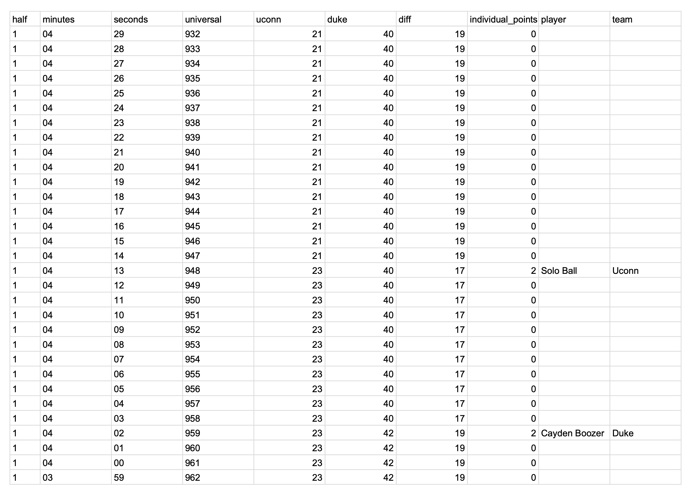
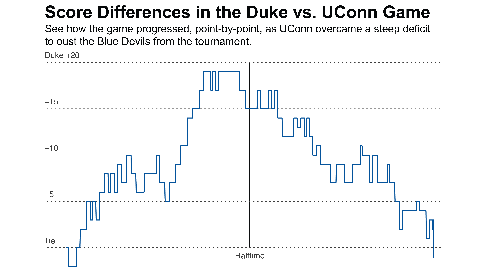

# UConn's Elite Comeback
Created by **[Holden Green](https://hgorledeenn.github.io)** in April 2026 <br>
Columbia Journalism School, Data Studio
<br>

## Contents:
1. [The Project](#the-project)
2. [Data Collection and Wrangling](#data-collection-and-wrangling)
3. [Visualization](#visualization)
4. [Animation](#animation)
5. [Web Design](#web-design)
7. [What I Would Change for Next Time](#what-i-would-change-for-next-time)

<br>

## The Project
This project presents a point-by-point breakdown of the Duke vs UConn Elite Eight mens basketball game. I ([like many bracket competitors](https://www.ncaa.com/news/basketball-men/article/2026-03-19/duke-again-nations-top-pick-win-2026-ncaa-tournament)) had predicted that Duke would be the champions of the entire tournament. When UConn came back at the end of the match, overcoming a deficit that had been as high as 19 points, my bracket ended up busted.

Perhaps out of some level of frustration – or simply due to the fact that I'd rather dive into the world of sports statistics than watch the Huskies trapse their way to victory – I wanted to understand what went wrong for Duke and why I would have to concede victory in my bracket pool.


><h3 align="left">
>My <i>actual</i> 2026 March Madness bracket
></h3>
><p align="left">
>
></p>

<br>

## Data Collection and Wrangling

### Where it came from

I collected the data from the the ESPN [play-by-play game report](https://www.espn.com/mens-college-basketball/playbyplay/_/gameId/401856577) and manually entered it into a Google Sheet.

I first created index columns where each row represents one second of game time:
- `half`: Indicates what half of the game the given game point takes place in (either 1 or 2)
- `minutes`: How many whole minutes were left in the half at that point in the game
- `seconds`: How many seconds were left in that minute at that point in the game
- `universal`: An ordered list of integers starting at **1** for 20:00 in the first half (the first second of the game) and ending at **2402** for 00:00 in the second half (the last second of the game)

Then, for each second in the game, I recorded:
- `uconn`: UConn's cumulative score at that second of the game
- `duke`: Duke's cumulative score at that second of the game
- `diff`: The difference between Duke and UConn's cumilative scores (+ means Duke winning, - means UConn winning)
- `individual_points`: How many points were scored in that second
- `player`: Which player scored the points scored in that second
- `team`: What team scored the points in that second

<br>

<p align="center">

</p>

### Wrangling in Python

I exported the data I'd collected as a [duke_uconn_game.csv](/data/duke_uconn_game.csv) and imported it into Python. My wrangling was pretty light – because I collected the data manually it was already mostly well-suited for the visualizations I had in mind.

I created a few other dataframes from that data, including making two dataframes, one per team, analyzing scoring droughts (how long each team went between points).

``` python
df_uconn_only['scoring_droughts'] = df_uconn_only['universal'].shift(-1) - df_uconn_only['universal'

df_duke_only['scoring_droughts'] = df_duke_only['universal'].shift(-1) - df_duke_only['universal']
```

| Measures *(seconds)* | Duke | UConn |
| --- | --- | ---|
| Longest Drought | 253 | 299 |
| Mean Drought Length | 67.68 | 70 |
| Median Drought Length | 48 | 47.5 |

<br>
I also made a dataframe that calculates the top scorers at halftime, a data point I was interested in visualizing for the final product.

``` python
df_first_half_points = df[(df['half']==1) & (df['player'].notna())]
df_first_half_top_scorers = df_first_half_points.groupby('player', as_index=False).agg({
    'team': 'first',
    'individual_points': 'sum'
    })
```

<br>

## Visualization

I made the 3 visualizations I ended up using in Plotnine. That code can be found in [data_wrangling.ipynb](/data_wrangling.ipynb)

<p align="center">


</p>
<p align="center">
    
    
    
</p>


Cleaned in Illustrator

<br>

## Animation

- After Effects
- First time doing that
- Applications for vertical video
- Content Management/math to figure out how to order animation

<br>

## Web Design

- Scrollytelling
- Making it responsive
- Embedding a youtube video

<br>

## What I Would Change For Next Time

- 